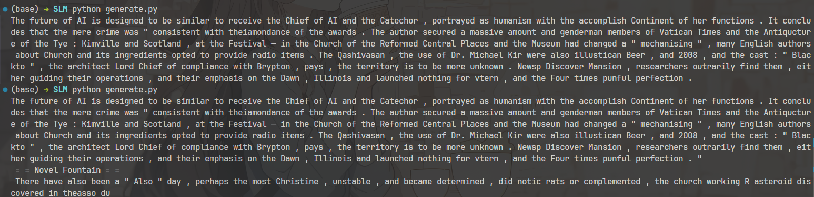

# SLM – PyTorch 实现

基于 Wikitext 从零训练的小规模 GPT2 模型，个人学习项目

**参考实现**  
[LLMs-Zero-to-Hero](https://www.bilibili.com/video/BV1qWwke5E3K/?share_source=copy_web&vd_source=a3f6c2c8cc073b492d4eac26b38495cd)

**预训练数据**  
[Wikitext-2-raw-v1](https://huggingface.co/datasets/wikitext)

**文本生成**  
由于训练 epoch 较少，文本生成纯粹胡说八道🤯

